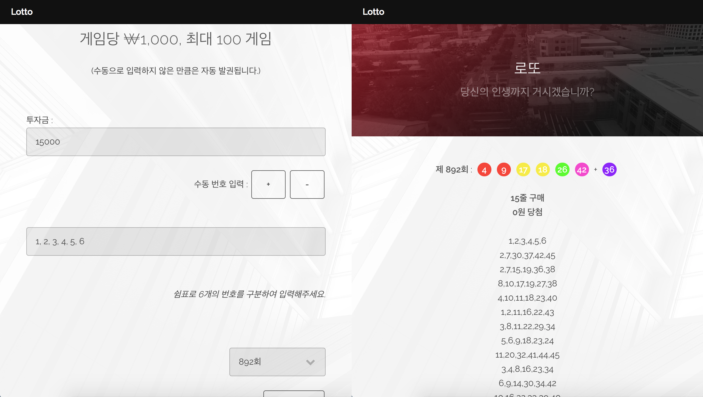

# Virtual Lotto Simulator (Enterprise Edition)

 

입력된 금액만큼 자동 및 수동으로 로또를 구매하고, 예상 결과를 확인하세요!

 

* 로컬에 docker 및 DB 설치 후

* _ormconfig.json 파일의 이름에서 언더스코어를 제거하고 [이곳](https://github.com/typeorm/typeorm/blob/master/docs/using-ormconfig.md)의 설명에 따라 작성 후

* run.sh 실행

   

_Typescript implementation of [java-lotto by woowacourse](https://github.com/woowacourse/java-lotto)_
